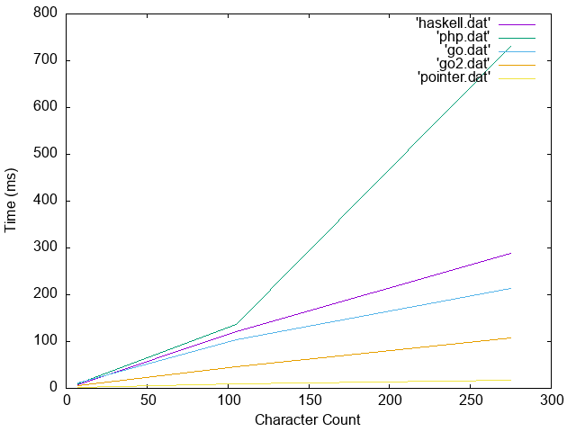

[Dev.to](https://dev.to/) has a daily challenge and I happened upon the [Duplicate Encoder #259 for 2020](https://dev.to/thepracticaldev/daily-challenge-259-duplicate-encoder-2e8l)

I didn't really want to solve the challenge per se, so instead I took the top comments for implementation and wrote them in [D Lang](https://dlang.org/).

For clarity these are all implemented in D and do not reflect the language performance that the implementation is based on.

The "Haskel" implementation utilizes a range based map/filter approach to detecting duplicates.

The "PHP" implementation utilizes a nested loop apporach to intentify that the character occurs again.

The "Pointer" implementation was just something I wanted to try. It duplicates the array so it is mutable
after which point it does not loop over the arry twice and instead stores pointers to the location of the
same character. It takes quite a bit for this approach to see any performance gain.
